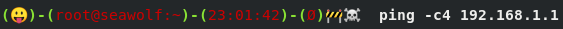

# Dotfiles
My personal stash of dotfiles.

## Installation
For an empty directory, installation is probably just as simple as
```
cd $HOME
git clone https://github.com/mjeromin/dotfiles.git .
```

Another way could be
```
cd $HOME
git clone https://github.com/mjeromin/dotfiles.git /tmp/dotfiles
mv /tmp/dotfiles/.git $HOME/
git reset --hard HEAD
rm -rf .git/ /tmp/dotfiles
```

## .bash_prompt
This is probably the most interesting dotfile, especially now that most terminal emulators support [color](https://www.tldp.org/HOWTO/Bash-Prompt-HOWTO/x329.html) and [emoji](https://www.unicode.org/emoji/charts/full-emoji-list.html#1f600). This file controls the Bash prompt behavior. $PS1 is dynamically generated with features that include: displaying of exit code status, an alarm clock, mail notification, current working directory, current time, current git branch, number of commits ahead/behind, as well as the number of git stashes.




### Alert Tray
The alert tray is the left-most tray and is reserved for alerting functionality.

#### Last Exit Code
This emoji is generated by the `_eximoji()` function which uses the exit code from the last executed command to choose from a set of happy faces if the code was 0 (ie. successful) and from a set of perplexed, distressed, mad, sad faces if the code was not 0 (ie. error).

#### Mail Notification
This emoji is generated by the `_mailmoji()` function and used to indicate new mail. It checks the local user's UNIX mail spool for new mail and generates the appropriate mailbox emoji. If there is a problem checking the mailbox, a wrench emoji will appear. If there is no mailbox, nothing is printed. 

#### Alarm Clock
This emoji is generated by the `_alarmoji()` function when the environment variable `ALARMCLOCK` is set to a 24-hour time `HH:MM` (ie. `ALARMCLOCK=15:45`). It is used to alert the user when the alarm time has exired by blinking the emoji. To turn off the clock, just unset this variable.

### User Tray
The user tray is next from left-to-right and is reserved for environment details. It takes advantage of a couple [PS1 "macros"](https://www.gnu.org/software/bash/manual/html_node/Controlling-the-Prompt.html):
* \u: username of the current user
* \h: short hostname (up to the first '.')

For awhile I was using `\W` to print the current working directory, but the prompt became too long so I started using pwdtrunc() to shorten it to 25 characters.

### Time Tray
The time tray is next from left-to-right and is reserved for displaying the time in 24-hour format. It takes advantage of the `\t` $PS1 macro.

### Git Tray
The git tray is last in line from left-to-right and is reserved for displaying information related to any git repos that may be in your current working directory, or parent working directories. This information includes: current git branch name (prepended with a `β`), number of commits ahead/behind (ie. `+3`), and number of git stashes(ie. `Δ1`). If no git repo is detected, then the Scandinavian vowel `Ø` is used.

### Random Emoji
For fun, a random emoji (per session) is printed at the tail of the prompt via the `_randomoji()` function.

### Tested
The prompt has been tested for working emoji and color in [Fedora 28](https://getfedora.org/) on the following terminals:
* gnome-terminal
* konsole
* roxterm
* terminology
* mate-terminal
* pantheon-terminal
* lilyterm
* termit
* cool-retro-term (working emoji, obviously color is monochrome)

Unfortunately, these terminals are not yet ready for emoji:
* qterminal
* Eterm
* xterm

## Licensing
Most of the files in this repo are public domain (see [PUBLIC DOMAIN](./LICENSE-PUBLICDOMAIN)) unless specified differently at the top of the file. When possible, I tried giving credit to any originators of public domain works in the comments.
